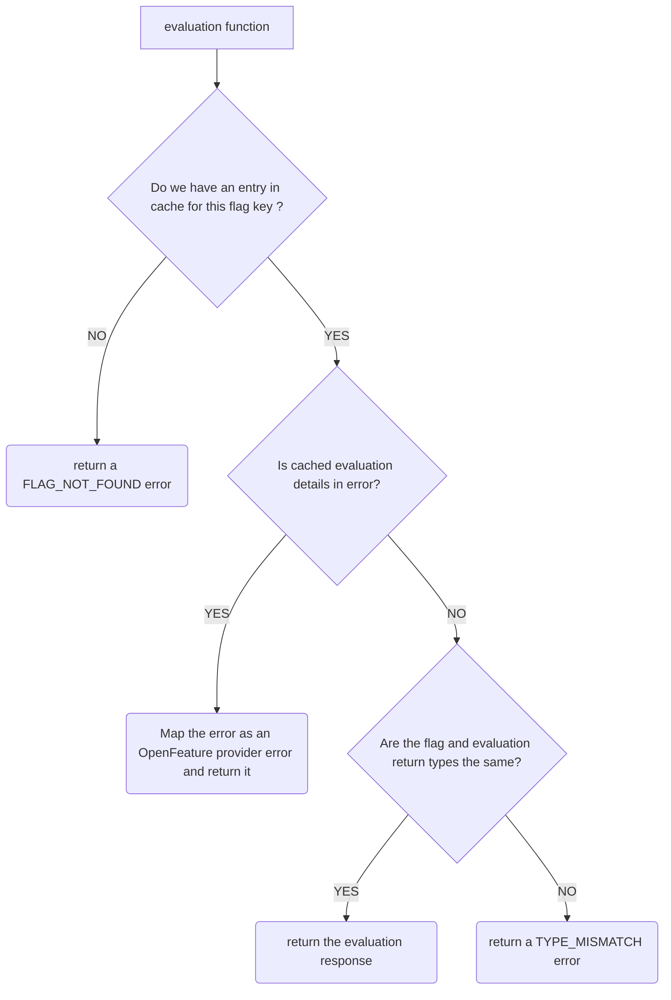

# Creating an OFREP client provider

OpenFeature Remote Evaluation Protocol (OFREP) is an API specification for feature flagging that allows the use of generic providers to connect to any feature flag management systems that supports the protocol.

In this document, we will specify how to write an OFREP provider using the [static-context-paradigm](https://openfeature.dev/specification/glossary/#static-context-paradigm) that is used on client side applications typically operate in the context of a single user. 
We will keep the document language agnostic.

**Pre-requisite:**
- Understanding of [general provider concepts](https://openfeature.dev/docs/reference/concepts/provider/)
- Understanding of the [OFREP](../../README.md)
- Understanding of the [OFREP OpenAPI specification](../../service/openapi.yaml)

## Constructor
An implementation of an OFREP client provider should allow in the creation of the provider to take as options:
- `baseURL`: The base URL of the [flag management system](https://openfeature.dev/specification/glossary#flag-management-system).  
  This should be the base of the URL pointing before the `/ofrep` namespace of the API.
  - In the constructor, the provider should check if the `baseURL` is a valid URL and return an error if the URL is invalid.
- `headers`: The headers to use when calling the OFREP endpoints *(ex:`Authorization`, Custom headers, etc ...)*.
- `pollInterval`: The polling interval defining when to call again the flag management system.
  - If `pollInterval` is equals to 0, polling will be disabled.

## Initialize the provider
An implementation of an OFREP client provider should start with an initialization of the provider.

The `initialize()` function should follow those steps:
1. Make a POST request to the `/ofrep/v1/evaluate/flags` endpoint with the evaluation context in the body.

   **Request body example**:
   ```json
    {
      "context": {
        "targetingKey": "f021d0f9-33b7-4b22-b0bd-9fec66ba1d7d",
        "firstname": "foo",
        "lastname": "bar",
        "email": "foo.bar@ofrep.dev"
      }
    }
   ```

    - If the endpoint returns an error, the `initialize()` function must error and exit.  
    - If the request is successful:
      - We should store in a local cache all of the flags evaluation details returned by the API. 
      - We should store the `ETag` header in the provider to be able to send it back later.
2. If `pollInterval` is more than `0`, we should start a polling mechanism to periodically check for flag changes *([See polling section](#polling))*.

## Evaluation
The evaluation should not perform any remote API calls and use the local cache.

When calling an evaluation function, the provider should follow those steps:
1. Retrieve the evaluation details for this flag from the local cache.
2. If you are not able to find the flag in the local cache, we should return an `FLAG_NOT_FOUND` error.
3. If the evaluation details contains an error, we should map the error in provider to an OpenFeature error and return it.
4. If the value of the evaluation details in the cache has a different type than the one expected by the evaluation function you should return a `TYPE_MISMATCH` error.
5. If the evaluation details retrieved from the cache is successful, you should return the evaluation details.




## Polling
The polling system will make a `POST` request periodically to the `/ofrep/v1/evaluate/flags` endpoint with the evaluation context in the body to check if there is a change in the flags evaluation to be able to store it.
The goal is to be able to know when a flag has changed for this evaluation context.

When you call the API if an `ETag` of a previous evaluation is available it is required to add the header `If-None-Match` with the `ETag` value to the `POST` request.

When calling the API you can have those response codes:
- `304`: Means that your current cache is up-to-date.
- `401`, `403`: The provider is not authorized to call the OFREP API. In that situation we should return an error and stop polling.
- `429`: You have reached the rate limit of the flag management system. In that situation the provider should read the `Retry-After` header from the response and ensure that we are not calling the endpoint again before this date.
- `200`: The cache is outdated. In that situation we should:
  1. Clear the actual cache.
  2. Cache the evaluation details received.
  3. Read the `ETag` header and store it for future call the API.
  4. Emit an `ConfigurationChanged` event containing in the `flagsChanged` field, a list of the flag key that have changed.

## Change context
In the client providers, a change of context should be handle to retrieve a new version of the cache.

When the function `onContextChange` is called, we should call the `/ofrep/v1/evaluate/flags` endpoint with the evaluation context in the body to check if we have to update the cache. In that situation we should handle the response the same way we are doing it for polling.