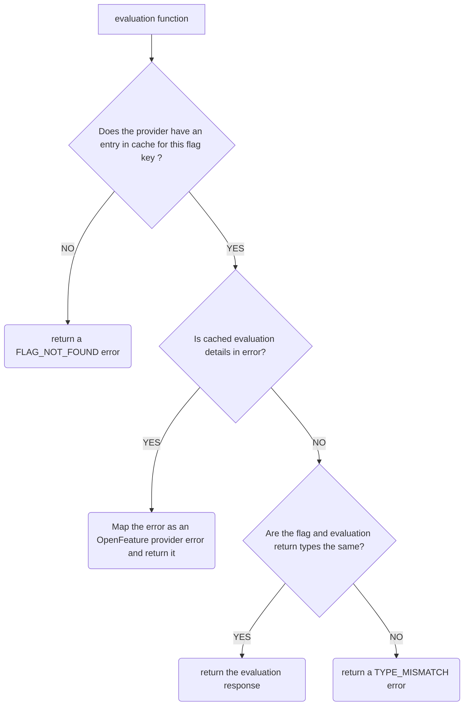

# Creating an OFREP client provider

OpenFeature Remote Evaluation Protocol (OFREP) is an API specification for feature flagging that allows the use of generic providers to connect to any feature flag management systems that supports the protocol.

In this document, we will specify how to write an OFREP provider using the [static-context-paradigm](https://openfeature.dev/specification/glossary/#static-context-paradigm) that is used on client side applications typically operating in the context of a single user. 

**Pre-requisite:**
- Understanding of [general provider concepts](https://openfeature.dev/docs/reference/concepts/provider/)
- Understanding of the [OFREP](../../README.md)
- Understanding of the [OFREP OpenAPI specification](../../service/openapi.yaml)

## Configuration
An OFREP client provider implementation must, at the time of creation, accept at least these options
- `baseURL`: The base URL of the [flag management system](https://openfeature.dev/specification/glossary#flag-management-system).  
  This must be the base of the URL pointing before the `/ofrep` namespace of the API.
  - In the constructor, the provider should check if the `baseURL` is a valid URL and return an error if the URL is invalid.
- `headers`: The headers to use when calling the OFREP endpoints *(e.g.:`Authorization`, Custom headers, etc ...)*.
- `pollInterval`: The polling interval defining how often to update the cached flags in the provider.
  - If `pollInterval` is equal to 0, polling will be disabled.
  - See [polling section](#polling) for more details.
- `timeout`: This specifies the duration to wait for a response before canceling the HTTP request. If no value is provided, a default timeout of `10 seconds` must be applied.

## Initialize the provider
The following describes the [initialization](https://openfeature.dev/specification/sections/providers#24-initialization) of an OFREP provider:

The `initialize()` function must follow those steps:
1. Make a POST request to the `/ofrep/v1/evaluate/flags` endpoint with the evaluation context in the body.

   **Request body example**:
   ```json
    {
      "context": {
        "targetingKey": "f021d0f9-33b7-4b22-b0bd-9fec66ba1d7d",
        "firstname": "foo",
        "lastname": "bar",
        "email": "foo.bar@ofrep.dev"
      }
    }
   ```

    - If the endpoint returns an error, the `initialize()` function must error and exit.  
    - If the request is successful:
      - The provider must store in a local cache all of the flags evaluation details returned by the API. 
      - The provider must store the `ETag` header in the provider to be able to send it back later.
2. If `pollInterval` is more than `0`, a polling mechanism must be started to periodically check for flag changes *([See polling section](#polling))*.

## Evaluation
The evaluation MUST not perform any remote API calls and use the local cache.

When calling an evaluation function, the provider must follow those steps:
1. Retrieve the evaluation details for this flag from the local cache.
2. If the provider is not able to find the flag in the local cache, it must return an `FLAG_NOT_FOUND` error.
3. If the evaluation details contains an error, the provider must map the error in provider to an OpenFeature error and return it.
4. If the value of the evaluation details in the cache has a different type than the one expected by the evaluation function the provider must return a `TYPE_MISMATCH` error.
5. If the evaluation details retrieved from the cache is successful, the provider returns the evaluation details.




## Polling
The polling system must periodically (interval defined by `pollingInterval`) make a `POST` request to the `/ofrep/v1/evaluate/flags` endpoint with the evaluation context in the body to check if there is a change in the flags evaluation to be able to store it.
If the flags changed, the provider cache for evaluation is updated.

When calling the API, if an `ETag` of a previous evaluation is available, it must be added to the [`If-None-Match`](https://developer.mozilla.org/en-US/docs/Web/HTTP/Reference/Headers/If-None-Match) header with the `ETag` as value.

When calling the API the provider can receive those response codes:
- `304`: Means that the current cache is up-to-date.
- `401`, `403`: The provider is not authorized to call the OFREP API. In that situation the provider should emit a `fatal` event and stop the polling mechanism. The provider will be in a [terminal error state](https://openfeature.dev/specification/sections/flag-evaluation#requirement-177).
- `429`: The provider has reached the rate limit of the flag management system. In that situation the provider should read the `Retry-After` header from the response and ensure that no call to the endpoint happened before this date.
- `200`: The cache is outdated. In that situation the provider must:
  1. Clear the actual cache.
  2. Cache the new evaluation details received.
  3. Read the `ETag` header and store it for future call the API.
  4. Emit an `ConfigurationChanged` event containing in the `flagsChanged` field, a list of the flag key that have changed.

## Change context
In the client providers, a change of context should be handle to retrieve a new version of the cache, it is called that the [Provider context reconciliation](https://openfeature.dev/specification/sections/providers/#26-provider-context-reconciliation).

When the function `onContextChange` is called, the provider should call the `/ofrep/v1/evaluate/flags` endpoint with the evaluation context in the body to check if the cache needs to be updated. In that situation the provider must handle the response the same way it does for polling.