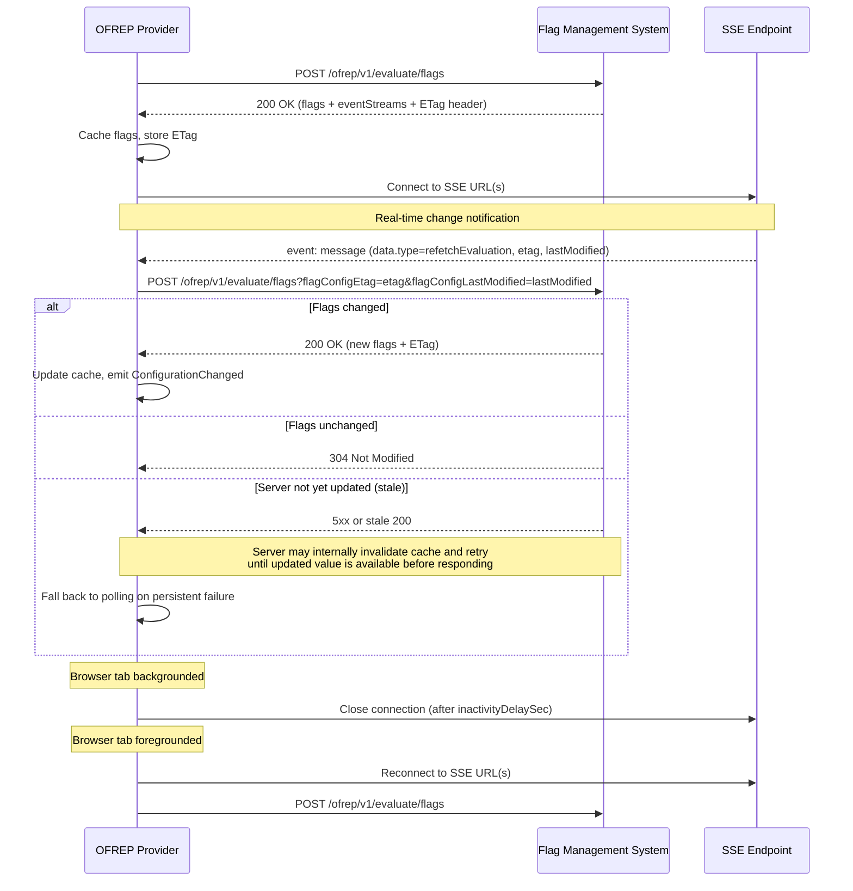

# 8. Server-Sent Events (SSE) for bulk evaluation changes

Date: 2026-02-20

## Status

Proposed

## Context

OFREP currently relies exclusively on polling for flag change detection. As described in [ADR-0005](0005-polling-for-bulk-evaluation-changes.md), polling was chosen initially for simplicity, with the explicit expectation that additional change detection mechanisms would be added later.

This ADR defines SSE as a real-time change notification mechanism for OFREP. The primary use case is static-context providers (web and mobile) that use bulk evaluation caching, but SSE is also applicable to server-side providers using individual flag evaluations. A standalone endpoint for providers doing in-process local evaluation (outside of OFREP) is deferred to a follow-up ADR.

Polling has known limitations:
- There is no way to implement real-time flag updates
- Frequent polling introduces unnecessary load on flag management systems
- There is an inherent latency between flag changes and client awareness, bounded by the poll interval

The [vendor survey](https://docs.google.com/forms/d/1NzqKx57XvRK_2lRQOFCRmF5exet6f15-sCjdEy0HCS8#responses) referenced in ADR-0005 confirmed that many vendors already use SSE for change notification. Without a standardized mechanism in OFREP, each vendor must implement proprietary push solutions, undermining the protocol's goal of vendor-agnostic interoperability.

Server-Sent Events (SSE) is a W3C standard that fits this use case well:
- Unidirectional (server-to-client), matching the notification pattern
- Runs over standard HTTP without protocol upgrades
- Natively supported in browsers via the `EventSource` API
- Built-in reconnection support; when events include `id`, reconnecting clients can send `Last-Event-ID` to resume from the last processed event
- Works through proxies, CDNs, and standard HTTP infrastructure

## Decision

Add an optional `eventStreams` array to the bulk evaluation response (`POST /ofrep/v1/evaluate/flags`) and the single flag evaluation response (`POST /ofrep/v1/evaluate/flags/{flagKey}`). When present, it provides connection endpoints that the provider connects to for real-time flag change notifications.

SSE is used as a **notification-only** mechanism -- events signal the provider to re-fetch evaluations via the existing endpoints, rather than streaming full evaluation payloads. This keeps the SSE message format simple, reuses existing infrastructure, and avoids duplicating evaluation logic.

### Response Schema

Add an optional `eventStreams` field to `bulkEvaluationSuccess` and `flagEvaluationSuccess`:

```json
{
  "flags": [
    {
      "key": "discount-banner",
      "value": true,
      "reason": "TARGETING_MATCH",
      "variant": "enabled"
    }
  ],
  "eventStreams": [
    {
      "type": "sse",
      "url": "https://sse.example.com/event-stream?channels=env_abc123_v1",
      "inactivityDelaySec": 120
    }
  ],
  "metadata": {
    "version": "v12"
  }
}
```

Each event stream object has:
- `type` (string, required): The connection type. Currently `"sse"` is the only defined value. Providers must ignore entries with unknown types for forward compatibility, allowing new push mechanisms to be added without breaking existing clients.
- `url` (string, required): The endpoint URL. The URL is opaque to the provider and may include authentication tokens, channel identifiers, or other vendor-specific query parameters. Implementations must treat this URL as sensitive -- it may contain auth tokens or channel credentials -- and must not log or persist the full URL including query string.
- `inactivityDelaySec` (integer, optional): Seconds of client inactivity (e.g., browser tab hidden, mobile app backgrounded) after which the connection should be closed. The client must reconnect and perform a full unconditional re-fetch when activity resumes. Minimum value is `1`. If omitted, providers should default to `120` seconds.

The `eventStreams` field is an array to support vendors whose infrastructure may require connections to multiple channels or endpoints (e.g., a global channel for environment-wide changes and a user-specific channel for targeted updates). Many SSE providers support multiple channels on a single URL, so the array will typically contain a single entry.

### SSE Event Format

Events use the standard [SSE event format](https://html.spec.whatwg.org/multipage/server-sent-events.html). The SSE `data` field is a raw string (multiple `data:` lines are concatenated per the W3C spec) that providers must parse as JSON:

```
id: evt-1234
event: message
data: {"type": "refetchEvaluation", "etag": "\"abc123\"", "lastModified": 1771622898}
```

The SSE envelope `event:` field is always `message`. Using a named SSE event type (e.g. `event: refetchEvaluation`) was considered but rejected — most SSE client libraries (Java, Swift, .NET, Python) do not support registering handlers per named event type and require manual dispatch regardless, so routing via a `type` field inside the JSON `data` payload achieves the same result consistently across all implementations. It also makes ignoring unknown future event types trivial with a single generic handler.

Providers must inspect `data.type` to determine behavior — not the SSE envelope `event:` field.

Event data fields:
- `type` (string, required): The OFREP event type inside the JSON data payload. Providers must handle `refetchEvaluation` and must ignore unknown values for forward compatibility.
- `etag` (string, optional): Latest flag configuration cache validation token sent over SSE metadata. If present, providers should include it as the `flagConfigEtag` query parameter on the re-fetch request.
- `lastModified` (string | integer, optional): Latest flag configuration timestamp sent over SSE metadata. Supports either Unix timestamp in seconds (recommended) or a date string (ISO 8601 or HTTP-date). If present, providers should include it as the `flagConfigLastModified` query parameter on the re-fetch request.

SSE envelope fields:
- `id` (string, recommended): Event identifier used by SSE clients for resume semantics via `Last-Event-ID`.

Reconnection and replay behavior:
- Providers should rely on standard SSE reconnect behavior and pass `Last-Event-ID` when supported by the client/runtime.
- Servers that support replay should emit stable event `id` values for `refetchEvaluation` events and replay missed events when `Last-Event-ID` is provided.
- Providers must perform an immediate bulk re-fetch after reconnect, even when replay is supported, to guarantee cache correctness across implementations with different replay retention policies.

Transporting SSE metadata to the bulk endpoint:
- `flagConfigEtag` and `flagConfigLastModified` are SSE-trigger metadata, not standard HTTP conditional request validators for endpoint-level response caching semantics.
- `flagConfigEtag` and `flagConfigLastModified` should only be sent when the re-fetch request is directly triggered by a received SSE message.
- For browser-based SDKs, using query parameters instead of custom headers avoids introducing additional non-safelisted headers that would require expanding `Access-Control-Allow-Headers` and helps keep CORS configuration simpler.
- The metadata originates from the SSE channel, so query parameters make the source and intent explicit.
- This is particularly useful for implementations where the OFREP server validates internal cache state and storage freshness directly (for example, cache + object storage bindings) rather than forwarding conditional headers upstream.
- To reduce cross-language date parsing ambiguity, providers and servers should prefer Unix timestamp in seconds for `lastModified` / `flagConfigLastModified` when possible.

### Provider Behavior



Provider implementation guidelines:
1. After the initial bulk evaluation response, if `eventStreams` is present, the provider should connect to any entries with a known `type` (currently `"sse"`).
2. On receiving a `refetchEvaluation` event, the provider must re-fetch flag evaluations from the bulk evaluation endpoint. If `etag` is present, it should be sent as `flagConfigEtag` query parameter. If `lastModified` is present, it should be sent as `flagConfigLastModified` query parameter. These query parameters should only be included for requests directly triggered by processing that SSE event.
   `lastModified` parsing should support Unix timestamp in seconds and date string formats.
3. Providers must apply an inactivity timeout for SSE connections using an effective `inactivityDelaySec` value: if `inactivityDelaySec` is specified in the response, use that value; if it is omitted, assume a default of 120 seconds. After this effective inactivity period, the provider should close the SSE connection. On resumption, it must reconnect and immediately perform a full unconditional re-fetch -- without `If-None-Match`, `flagConfigEtag`, or `flagConfigLastModified` -- to ensure the cache reflects the current server state after an unknown period of inactivity.
4. If the SSE connection fails or is unavailable, the provider must fall back to its configured change detection behavior: if polling is enabled, continue with polling; if polling is disabled, continue SSE reconnection attempts and rely on explicit refresh triggers such as `onContextChange`.
5. Providers should implement reconnection with exponential backoff. The native `EventSource` API in browsers handles this automatically.
6. When `onContextChange` is triggered, the provider re-fetches the bulk evaluation without SSE query metadata and updates its connections based on the new response:
   - If `eventStreams` is absent, close all existing connections and fall back to configured change detection behavior.
   - If `eventStreams` is present and the URL set is unchanged, existing connections may be reused.
   - If `eventStreams` is present and the URL set has changed, close existing connections then connect to the new URLs.
7. Providers SHOULD coalesce concurrent `refetchEvaluation` events into a single re-fetch request (e.g., via in-flight deduplication or a short debounce window) to avoid amplifying load on the flag management system when multiple connections fire simultaneously.

### OpenAPI Schema Additions

```yaml
# Add to /ofrep/v1/evaluate/flags and /ofrep/v1/evaluate/flags/{flagKey} POST parameters:
- in: query
  name: flagConfigEtag
  description: |
    Optional SSE-provided ETag metadata for SSE-triggered re-fetches. This is
    not a standard HTTP conditional request header; it is metadata for server-side
    cache validation and freshness checks initiated by SSE events. It should only
    be included when the request is directly triggered by a received SSE message.
  schema:
    type: string
  required: false
  example: "\"550e8400-e29b-41d4-a716-446655440000\""

- in: query
  name: flagConfigLastModified
  description: |
    Optional SSE-provided last-modified metadata for SSE-triggered re-fetches.
    Supports Unix timestamp in seconds (recommended) or a date string (ISO 8601 /
    HTTP-date), and is transported as query metadata rather than
    `If-Modified-Since`. It should only be included when the request is directly
    triggered by a received SSE message.
  schema:
    oneOf:
      - type: integer
        minimum: 0
      - type: string
  required: false
  examples:
    epochSeconds:
      value: 1771622898
    isoDate:
      value: "2026-02-20T21:28:18Z"
    httpDate:
      value: "Thu, 20 Feb 2026 21:28:18 GMT"

# Add to bulkEvaluationSuccess.properties and flagEvaluationSuccess.properties:
eventStreams:
  type: array
  description: |
    Optional array of real-time change notification connections. When present,
    the provider should connect to any entries with a known type and re-fetch
    flag evaluations when notified of changes. If not present, the provider
    should continue using polling for change detection. Entries with unknown
    types must be ignored for forward compatibility.
  items:
    $ref: "#/components/schemas/eventStream"

# Add to components.schemas:
eventStream:
  description: |
    A real-time change notification connection endpoint. The `type` field
    identifies the push mechanism; currently only `sse` is defined. Providers
    must ignore entries with unknown types for forward compatibility.
  type: object
  required:
    - type
    - url
  properties:
    type:
      type: string
      description: |
        The connection type identifying the push mechanism to use.
        Currently only `sse` is defined. Providers must ignore entries
        with unknown types for forward compatibility.
      example: "sse"
    url:
      type: string
      format: uri
      description: |
        The endpoint URL the client should connect to for real-time
        flag change notifications. The URL may include authentication tokens,
        channel identifiers, or other query parameters as needed by the
        vendor's infrastructure.
      example: "https://sse.example.com/event-stream?channels=env_abc123_v1"
    inactivityDelaySec:
      type: integer
      minimum: 1
      description: |
        Number of seconds of client inactivity (e.g., browser tab hidden,
        mobile app backgrounded) after which the connection should be closed
        to conserve resources. The client must reconnect and perform a full
        unconditional re-fetch when activity resumes. If omitted, providers
        should default to 120 seconds.
      example: 120
```

## Consequences

### Positive

- **Real-time flag updates**: Providers can receive flag change notifications immediately rather than waiting for the next poll interval
- **Reduced server load**: Eliminates unnecessary polling requests when flags have not changed
- **Vendor-agnostic**: The `url` field is opaque, allowing vendors to use any SSE infrastructure (hosted services like Ably/Pusher, self-hosted endpoints, CDN-based proxies)
- **Backward compatible**: The `eventStreams` field is fully optional -- servers that don't support it omit the field, providers that don't support it ignore the field and continue their configured change detection behavior
- **Builds on existing infrastructure**: Uses the existing bulk evaluation endpoint for data transfer, keeping SSE as a lightweight notification layer

### Negative

- **Additional provider complexity**: Providers must manage SSE connection lifecycle, reconnection, inactivity handling, and fallback behavior based on configured change detection settings
- **Infrastructure requirements**: Flag management systems that want to support SSE need to operate or integrate with an SSE-capable service
- **Connection resource usage**: Long-lived SSE connections consume resources on both client and server, particularly at scale
- **Re-fetch amplification risk**: Multiple SSE URLs or bursty event streams can trigger redundant concurrent re-fetches unless providers coalesce events
- **Transport consistency trade-off**: Using query parameters for SSE metadata differs from common HTTP conditional request patterns and may need careful documentation for implementers
- **Tokenized URL handling risk**: If SSE URLs include scoped credentials or channel tokens, accidental logging/persistence can expose sensitive connection material

## Open Questions

1. **Should `refetchEvaluation` be required, or should providers refetch on any SSE message?**
   - **Answer:** Requiring a specific `type` field enables future event types without triggering unnecessary refetches. This ADR recommends requiring `type=refetchEvaluation` for forward compatibility.

2. **Should providers support streaming full evaluation payloads over SSE?**
   - **Answer:** The notification-only + re-fetch approach works well for architectures using CDNs and edge workers that can absorb the burst of concurrent re-fetch requests. For providers without that infrastructure, sending the full config or a diff directly over SSE may be more appropriate. Future event types such as `fullConfig` or `patchConfig` could be defined in a follow-up ADR without breaking the existing contract.

3. **What is the recommended coalescing strategy when multiple SSE connections are specified?**
   - **Answer:** Providers should connect to all URLs and coalesce concurrent `refetchEvaluation` events via in-flight deduplication or a short debounce window. Minimum coalescing expectations are left to provider implementations for now.

4. **Should `inactivityDelaySec` be server-provided or client-side configuration?**
   - **Answer:** This ADR specifies `inactivityDelaySec` as server-provided, defaulting to 120 seconds when omitted. Providers may expose a client-side override, which should take precedence over the server-provided value.

5. **Should non-`refetchEvaluation` SSE messages be forwarded to the provider?**
   - **Answer:** A mechanism to forward unknown typed messages to the provider via an events/hook interface could be valuable but is deferred to a future revision.

6. **Should SSE metadata be transported via query parameters or custom headers?**
   - **Answer:** Query params are used as the single transport mechanism for all SDK types. Custom headers were considered but rejected because non-safelisted headers require expanding `Access-Control-Allow-Headers` in CORS configuration, and introduce additional complexity for browser-based SDKs. Query params also make the SSE origin of the metadata explicit, distinguishing `flagConfigEtag`/`flagConfigLastModified` from standard HTTP conditional request headers (`If-None-Match` / `If-Modified-Since`).

7. **What security requirements should apply to tokenized SSE URLs?**
   - **Answer:** Providers must not log or persist SSE URLs as they may contain auth tokens or channel credentials. Further requirements around token lifetime and rotation are left to vendor implementations.

## Implementation Notes

- **Provider change detection configuration**: Providers should expose a `changeDetection` configuration option with the following values:
  - `sse` *(default)*: Use SSE if the bulk evaluation response includes an `eventStreams` entry with `type: "sse"`. On connection failure, providers MAY fall back to polling only when polling is enabled (for example, when a positive `pollInterval` is configured); otherwise, they SHOULD continue attempting SSE and rely on explicit refresh triggers. If no `eventStreams` are present, polling is used (subject to the same polling configuration).
  - `polling`: Ignore `eventStreams` and rely solely on polling.
  - `none`: Perform no background refresh; rely solely on explicit `onContextChange` calls.
- **Existing SSE libraries**: The LaunchDarkly open-source SSE client libraries ([Java/Android](https://github.com/launchdarkly/okhttp-eventsource), [.NET](https://github.com/launchdarkly/dotnet-eventsource), [JavaScript](https://github.com/launchdarkly/js-eventsource), [Python](https://github.com/launchdarkly/python-eventsource), [Swift/iOS](https://github.com/launchdarkly/swift-eventsource)) are well-maintained and could be used by OFREP provider implementations. Browser environments can use the native `EventSource` API.
- **Provider guideline updates**: The [static context provider guideline](../../guideline/static-context-provider.md) would need a new section describing SSE connection management alongside the existing polling section. Server-side provider guidelines should also be updated to document SSE usage with single-flag evaluations.
- **Standalone endpoint for local evaluation**: Providers doing in-process local evaluation (outside of OFREP) have no evaluation response to carry `eventStreams`. A standalone endpoint such as `GET /ofrep/v1/eventStreams` that returns just the event stream connection details is deferred to a follow-up ADR.
