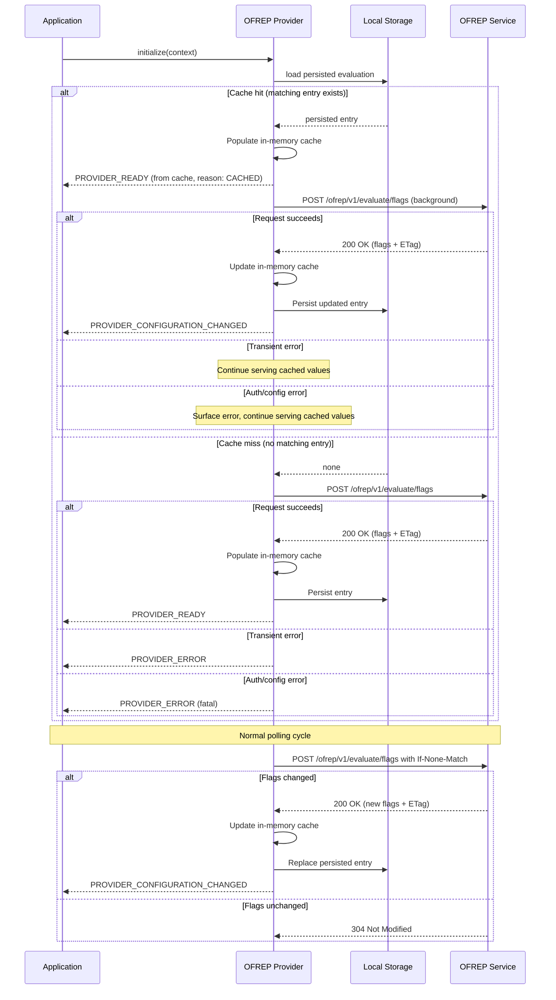

# 9. Persist static-context evaluations in local storage by default

Date: 2026-03-06

## Status

Proposed

## Context

OFREP static-context providers evaluate all flags in one request and then serve evaluations from a local cache.
Current implementations in `js-sdk-contrib`, `kotlin-sdk-contrib`, and `ofrep-swift-client-provider` keep that cache in memory only.

Static-context providers are primarily web and mobile providers, where applications are often restarted or temporarily offline.
In those cases, the last successful bulk evaluation is lost and applications fall back to errors or code defaults instead of continuing with a usable last-known state.
This is also out of step with most vendor-provided web and mobile SDKs for the same class of provider, which persist flag state to local storage or on-device disk by default.

Vendor SDKs from LaunchDarkly, Statsig, DevCycle, and Eppo all use a cache-first initialization pattern: load persisted evaluations immediately on startup so initial synchronous flag evaluations never return defaults, refresh from the network in parallel, and emit change events when fresh values arrive.
See [vendor mobile SDK caching research](https://gist.github.com/jonathannorris/4f2f63142b70719e3c6bfe8b226a0585) for a detailed comparison.

Persisting the last successful static-context evaluation and loading it on startup would extend the existing cache model across restarts and temporary connectivity loss without requiring protocol changes, while eliminating the flash-of-defaults problem that occurs when applications wait for a network response before evaluations return meaningful values.

## Decision

Static-context providers should persist their last successful bulk evaluation in local persistent storage by default, and use cache-first initialization to serve persisted evaluations immediately on startup.

Providers should expose a `cacheMode` option that controls this behavior, with three supported values:

- `cache-first` (default): load from the persisted cache immediately on startup so `initialize()` can return right away, then refresh from the network in the background.
- `network-first`: `initialize()` awaits the initial `/ofrep/v1/evaluate/flags` response (subject to the provider's existing request timeout). If the request succeeds, populate the in-memory cache from the response and persist it. If the request fails with a network error or `5xx`, fall back to the persisted entry when one exists. If the request fails with an authorization or configuration error (`401`, `403`, `400`), emit a fatal error as normal and do not fall back to cached values. This mode still writes successful evaluations to disk so cached values are available for fallback on future startups.
- `disabled`: no persistence at all. The in-memory cache is used during the session but nothing is written to or read from local storage. `initialize()` blocks on the network request (same as a cache miss).

The persisted entry should include:

- the bulk evaluation payload
- the associated `ETag`, if one was returned
- a `cacheKeyHash` equal to `hash(targetingKey)`, or `hash(cacheKeyPrefix + ":" + targetingKey)` when a `cacheKeyPrefix` is configured
- the time the entry was written, which can be used for diagnostics and optional implementation-specific staleness policies

Providers should support an optional `cacheKeyPrefix` configuration option. When provided, the prefix is included in the cache key hash: `hash(cacheKeyPrefix + ":" + targetingKey)`. This prevents collisions when multiple OFREP provider instances share the same local storage partition (e.g., two providers on the same web origin pointing at different OFREP servers). The prefix value is left to the application author; it could be the OFREP base URL, a project or auth token, or any other distinguishing string. When no prefix is configured, the cache key defaults to `hash(targetingKey)`.

Example persisted value:

```json
{
  "version": 1,
  "cacheKeyHash": "hash(targetingKey)",
  "etag": "\"abc123\"",
  "writtenAt": "2026-03-07T18:20:00Z",
  "data": {
    "flags": [
      {
        "key": "discount-banner",
        "value": true,
        "reason": "TARGETING_MATCH",
        "variant": "enabled"
      }
    ]
  }
}
```

The provider should continue to use its in-memory cache for normal flag evaluation.
Persistent local storage acts as the source used to bootstrap that in-memory cache on startup and update it on each successful refresh.

### Initialization

The initialization flow depends on the configured `cacheMode`. The default `cache-first` behavior is described in detail below and reflected in the sequence diagram; `network-first` and `disabled` follow variants of the same flow described in their own subsections.

#### `cache-first` initialization (default)

1. Attempt to load a matching persisted bulk evaluation from local storage (matching `cacheKeyHash`).
2. **If a matching persisted entry exists (cache hit):**
   - Populate the in-memory cache from the persisted entry immediately.
   - Return from `initialize()` so the SDK can emit `PROVIDER_READY`. Evaluations served from the persisted entry should use `CACHED` as the evaluation reason.
   - Attempt the `/ofrep/v1/evaluate/flags` request in the background.
   - If the background request succeeds, update the in-memory cache from the response, update the persisted entry, and emit `PROVIDER_CONFIGURATION_CHANGED`. Evaluations should switch to the server-provided reasons.
   - If the background request fails with a transient or server error (network unavailable, `5xx`), continue serving cached values and retry on the normal polling schedule.
   - If the background request fails with an authorization or configuration error (`401`, `403`, `400`), surface the error via logging or provider error events and continue serving cached values for the current session. The persisted entry should not be cleared; the cache TTL is responsible for eventual expiry. This ensures that subsequent cold starts can still bootstrap from cached values while the error is investigated, rather than immediately degrading to defaults.
3. **If no matching persisted entry exists (cache miss):**
   - Attempt the `/ofrep/v1/evaluate/flags` request and await the response.
   - If the request succeeds, populate the in-memory cache from the response, persist the entry, and return from `initialize()` (SDK emits `PROVIDER_READY`).
   - If the request fails with a transient or server error, preserve the existing initialization failure behavior (SDK emits `PROVIDER_ERROR`).
   - If the request fails with an authorization or configuration error, preserve the existing initialization failure behavior (SDK emits `PROVIDER_ERROR` with error code `PROVIDER_FATAL`).

#### `network-first` initialization

In this mode, `initialize()` awaits the initial `/ofrep/v1/evaluate/flags` request (subject to the provider's request timeout) rather than returning immediately from cache. A persisted entry is only used as a fallback when the network is unavailable.

1. Attempt the `/ofrep/v1/evaluate/flags` request and await the response.
2. **If the request succeeds**: populate the in-memory cache from the response, persist the entry, and return from `initialize()` (SDK emits `PROVIDER_READY`). Evaluations use the server-provided reasons. The application sees fresh values from the first evaluation with no cached flash.
3. **If the request fails with a transient or server error, or times out**:
   - Attempt to load a matching persisted entry from local storage.
   - If one exists, populate the in-memory cache from it and return from `initialize()` (SDK emits `PROVIDER_READY`). Evaluations use `CACHED` as the reason. Continue retrying the network request in the background.
   - If no persisted entry exists, preserve the existing initialization failure behavior (SDK emits `PROVIDER_ERROR`).
4. **If the request fails with an authorization or configuration error (`401`, `403`, `400`)**: preserve the existing initialization failure behavior (SDK emits `PROVIDER_ERROR` with error code `PROVIDER_FATAL`). Do not fall back to cached values, even if a persisted entry exists. The application has explicitly chosen to block on a fresh evaluation; an auth or configuration error is a real problem that should be surfaced rather than masked by cache.

Applications choosing `network-first` should consider lowering the provider's request timeout from its default so that initialization falls back to cache quickly when the network is unavailable, rather than leaving users staring at a loading state.

#### `disabled` cache initialization

When `cacheMode` is `disabled`, the provider does not read from or write to local storage. `initialize()` blocks on the `/ofrep/v1/evaluate/flags` request and behaves the same as the cache-miss path in `cache-first` mode. Persistence-related options (`cacheKeyPrefix`, TTL) have no effect.



The sequence diagram above shows the default `cache-first` flow. In `network-first` mode, `initialize()` instead awaits the network request first and only loads from cache on network failure (see the "`network-first` initialization" subsection above). In `disabled` mode, no storage reads or writes occur and `initialize()` blocks on the network request the same way the cache-miss path does today.

### Why PROVIDER_READY and not PROVIDER_STALE on cache hit

The spec defines `READY` as "the provider has been initialized, and is able to reliably resolve flag values" and `STALE` as "the provider's cached state is no longer valid and may not be up-to-date with the source of truth."

On cache-hit startup, the provider emits `PROVIDER_READY` rather than `PROVIDER_STALE` for two reasons.
First, at the moment of loading from cache, the provider does not yet know whether the cached values differ from the server. The values were correct as of the last successful evaluation and may still be current. The background refresh will determine whether they have changed.
Second, `PROVIDER_STALE` would break the initialization contract. Applications and SDKs listen for `PROVIDER_READY` to begin flag evaluation. If the provider emitted `PROVIDER_STALE` instead, the SDK would not transition out of `NOT_READY`, and flag evaluations would short-circuit to defaults, which defeats the purpose of cache-first initialization.

If the background refresh fails and the provider cannot confirm that cached values are current, the provider may emit `PROVIDER_STALE` at that point to signal that values may be out of date.

### Cache matching and fallback

Providers should only reuse a persisted evaluation when it matches the current static-context inputs.
This includes a matching `cacheKeyHash` equal to `hash(targetingKey)`, or `hash(cacheKeyPrefix + ":" + targetingKey)` when a `cacheKeyPrefix` is configured.

The cache key is intentionally derived from `targetingKey` alone rather than the full evaluation context.
Static-context evaluations on the server can depend on context properties beyond `targetingKey`, so cached values may not reflect the current full context.
However, hashing the full context is impractical for cache-first startup because many implementations set volatile context properties on initialization (e.g. `lastSessionTime`, `lastSeen`, `sessionId`) that would change the hash on every app restart, defeating the purpose of persistence.
The accepted tradeoff is that the cache is keyed by stable user identity: a change in `targetingKey` (user switch, logout) invalidates the cache, but changes to other context properties do not.
Those properties only affect evaluation when the server is reachable, at which point the provider refreshes anyway.

When the provider has not initialized from cache (cache miss path, or `network-first` mode), providers must not silently fall back to persisted data for authorization failures, invalid requests, or other responses that indicate a configuration or protocol problem. In `network-first` mode this applies even when a matching persisted entry exists: the application has explicitly chosen to block on a fresh evaluation, and an auth or configuration error should be surfaced rather than masked by the cache.

In `network-first` mode, fallback to a persisted entry is limited to network errors, `5xx` responses, and request timeouts. If a persisted entry exists in those cases, the provider loads it, emits `PROVIDER_READY` with `CACHED` as the evaluation reason, and continues retrying in the background.

When the provider has already initialized from cache (cache hit path in `cache-first` mode), authorization or configuration errors from the background refresh should be surfaced via logging or provider error events. The provider should continue serving cached values for the current session rather than revoking a working state. The persisted entry should not be cleared on auth or config errors; the cache TTL is responsible for eventual expiry. This avoids degrading subsequent cold starts to defaults while the error is investigated.

### Refresh and revalidation

When connectivity returns or during normal polling, the provider should resume its normal refresh behavior.
If an `ETag` was stored with the persisted entry, the provider should use it with `If-None-Match` when revalidating the bulk evaluation.

### Configuration

Providers should expose a `cacheMode` option with values `cache-first` (default), `network-first`, or `disabled`. Applications choose the mode based on their UX and consistency requirements:

- `cache-first` is appropriate for most mobile and web applications where the flash-of-defaults problem on cold start is the primary UX concern.
- `network-first` is appropriate for single-page applications and other use cases that already block rendering on initialization and want fresh values on every cold start, with cached values used only as a fallback when the network is unreachable.
- `disabled` is appropriate when platform requirements or policy constraints forbid persisting evaluation data.

Applications using `network-first` should consider lowering the provider's request timeout (`timeoutMs` or equivalent) from the default (typically `10000` ms) to a shorter value appropriate for blocking initialization, so that users do not sit on a loading state for the full timeout when the network is unavailable.

When applications configure more than one static-context provider against the same underlying storage (same browser origin, shared app container, etc.), each provider instance should be configured with a distinct `cacheKeyPrefix` so persisted entries are namespaced and instances do not load or overwrite each other's bulk evaluations.

Providers may additionally allow replacing the storage backend when platform requirements or policy constraints require a specific storage mechanism.

## Consequences

### Positive

- Cache-first initialization eliminates the flash-of-defaults problem, where applications briefly show default values before evaluated values arrive
- Static-context providers become resilient to offline application startup when a last-known evaluation exists
- Web and mobile applications preserve feature state across restarts instead of losing it with the in-memory cache
- Applications with strict consistency requirements (e.g., SPAs that already block rendering on flag evaluation and prefer fresh values on every cold start over potential flicker from cached values) can opt into `network-first` mode while still retaining persistence for offline fallback
- The decision aligns with the established pattern used by vendor SDKs (LaunchDarkly, Statsig, DevCycle, Eppo) and with the existing OFREP model where static-context providers evaluate remotely once and then read locally
- Reusing the stored `ETag` allows efficient revalidation when connectivity returns
- Provider implementations get a consistent default expectation for offline behavior across ecosystems

### Negative

- Providers become more complex because they must manage persistence, cache-key matching, and recovery flows
- Persisted evaluations may become stale, so applications can continue using outdated flag values while offline
- Applications may briefly see stale cached values before fresh values arrive, and should handle `PROVIDER_CONFIGURATION_CHANGED` events if they need to react to updates
- Persisting evaluation data on-device means flag values are stored in plaintext in platform-local storage, which may be accessible to other code running in the same origin (web) or on compromised devices (mobile)
- Mobile platforms do not share a single storage API, so providers may need platform-specific defaults behind a common abstraction
- Existing OFREP static-context providers (`js-sdk-contrib`, `kotlin-sdk-contrib`, `ofrep-swift-client-provider`) all block `initialize()` on a network request today. Adopting cache-first initialization requires lifecycle and event model changes in each implementation, particularly the Kotlin provider which currently emits `PROVIDER_READY` on poll updates instead of `PROVIDER_CONFIGURATION_CHANGED`

## Alternatives Considered

### Make persistence opt-in instead of the default

This reduces default behavior changes, but it produces inconsistent offline behavior across provider implementations and requires every application to rediscover and enable the same capability.
For static-context providers, especially web and mobile providers, persistence is expected behavior rather than an exceptional optimization.

### Fall back to cache only on network failure

In this approach, the provider always attempts the network request first and only falls back to cached evaluations when the request fails.
This is simpler to implement but introduces the flash-of-defaults problem on every normal startup: applications must wait for the network response before flag evaluations return meaningful values.
Every major vendor SDK (LaunchDarkly, Statsig, DevCycle, Eppo) uses cache-first initialization instead because it produces better UX for end users.

This approach is still available to applications as a non-default mode via `cacheMode: "network-first"`, which is appropriate for SPAs and similar use cases that already block rendering on initialization.

### Two separate booleans (`disableLocalCache` + `cacheFirstInit`)

An earlier version of this ADR used a single `disableLocalCache` boolean. Adding a second boolean for initialization strategy would have given three meaningful combinations plus one nonsensical one (`disableLocalCache: true` combined with `cacheFirstInit: true` has no cache to load from).
A single `cacheMode` enum with three explicit values is clearer and avoids the nonsensical combination.

### Platform-specific defaults (cache-first on mobile, network-first on web)

The right initialization behavior depends on application type rather than platform. Many web applications (especially PWAs and apps with persistent sessions) benefit from cache-first, while some mobile apps might prefer network-first for specific consistency requirements.
A single default (cache-first) with an explicit per-application opt-out is clearer than per-platform defaults that authors would need to learn and override.

## Implementation Notes

- "Local storage" means a local persistent key-value store appropriate for the runtime, such as browser `localStorage` on the web or an equivalent mobile storage mechanism
- Providers should version their persisted format so future schema changes can be handled safely
- Providers should avoid persisting raw `targetingKey` values when `cacheKeyHash` is sufficient for matching
- Providers should expose a `cacheMode` option with values `cache-first` (default), `network-first`, and `disabled`. `network-first` and `disabled` block `initialize()` on the network request; `cache-first` returns from `initialize()` immediately when a persisted entry exists
- Providers should expose an optional `cacheKeyPrefix` configuration option so multiple provider instances sharing one storage partition do not collide on the same storage key
- Providers should clear or replace persisted entries when the `targetingKey` changes, such as on logout or user switch
- In `cache-first` mode, the `initialize()` function should return immediately when a matching cached entry exists, allowing the SDK to emit `PROVIDER_READY` from cache
- Providers should emit `PROVIDER_CONFIGURATION_CHANGED` when fresh values replace cached values after a background refresh
- If `onContextChanged()` is called while a background refresh is still in-flight, the provider should cancel or discard the in-flight request. The context-change evaluation supersedes it and should be the authoritative write to the persisted entry
- On the first cold start in `cache-first` mode (no persisted entry), `initialize()` blocks on the network request as normal. Cache-first initialization only returns immediately once a successful evaluation has been persisted
- In `network-first` mode, applications should consider lowering the provider's request timeout (e.g., `timeoutMs`) from the default so that initialization falls back to cache or fails quickly when the network is unavailable, rather than leaving users on a loading state for the full timeout
- SDK documentation should note that initial evaluations may return cached values (with `CACHED` reason) that are subsequently updated when fresh values arrive
- Providers should enforce a configurable TTL on persisted entries to ensure stale caches are eventually purged, particularly in cases where the provider can no longer refresh from the server (e.g. persistent auth errors). Since auth and config errors do not clear the persisted cache, the TTL is the mechanism that prevents indefinitely stale data. DevCycle uses a 30-day default (`configCacheTTL`) as a reference.
- If a storage write fails (e.g. quota exceeded, permission denied), the provider should log the error and continue operating with the fresh values in memory. The previously persisted entry, if any, remains on disk for the next cold start.

## Open Questions

1. Should providers support caching evaluations for multiple targeting keys (like LaunchDarkly's `maxCachedContexts`), or only retain the most recent? Multi-context caching enables instant user switching on shared devices but increases storage usage.
2. Should the storage key include a namespace to prevent collisions when multiple OFREP providers share the same local storage origin?
   - **Answer:** Yes. Providers should support an optional `cacheKeyPrefix` configuration option. When provided, the cache key becomes `hash(cacheKeyPrefix + ":" + targetingKey)` instead of `hash(targetingKey)`. The prefix value is left to the application author (e.g., the OFREP base URL, a project or auth token, or any other distinguishing string). The default (no prefix) keeps the single-provider case simple. See the `cacheKeyPrefix` section in the Decision above.
