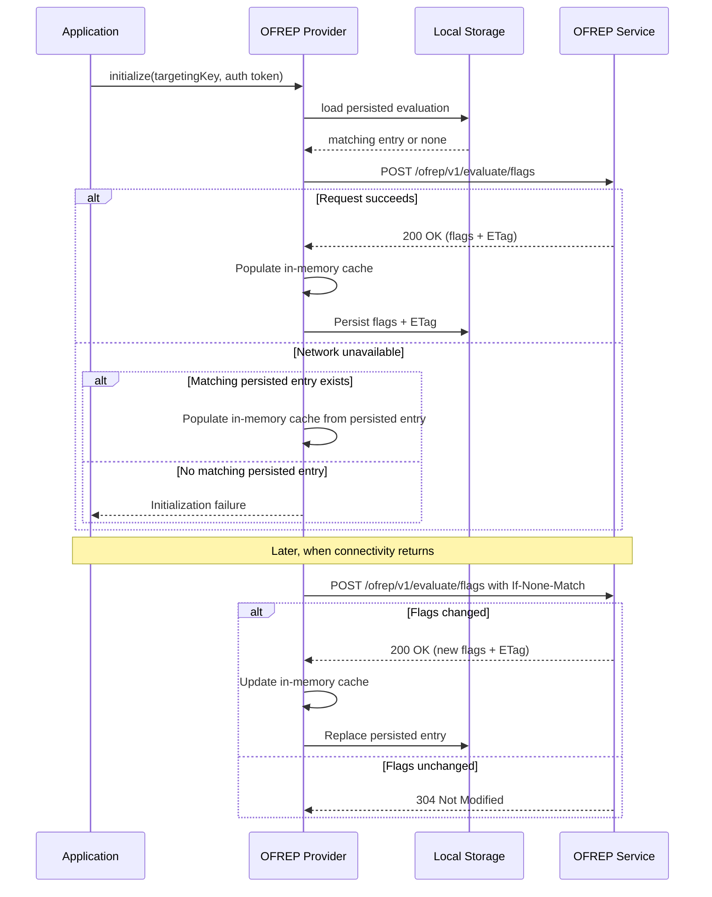

# 9. Persist static-context evaluations in local storage by default

Date: 2026-03-06

## Status

Proposed

## Context

OFREP static-context providers evaluate all flags in one request and then serve evaluations from a local cache.
Current implementations in `js-sdk-contrib`, `kotlin-sdk-contrib`, and `ofrep-swift-client-provider` keep that cache in memory only.

Static-context providers are primarily web and mobile providers, where applications are often restarted or temporarily offline.
In those cases, the last successful bulk evaluation is lost and applications fall back to errors or code defaults instead of continuing with a usable last-known state.
This is also out of step with most vendor-provided web and mobile SDKs for the same class of provider, which persist flag state to local storage or on-device disk by default.

Persisting the last successful static-context evaluation would extend the existing cache model across restarts and temporary connectivity loss without requiring protocol changes.

## Decision

Static-context providers should persist their last successful bulk evaluation in local persistent storage by default.

The persisted entry should include:

- the bulk evaluation payload
- the associated `ETag`, if one was returned
- a `cacheKeyHash` equal to `sha256(authToken + targetingKey)`
- the time the entry was written, which can be used for diagnostics and optional implementation-specific staleness policies

Providers may store this as a single fixed local record, for example under a runtime-appropriate key such as `ofrepLocalCache`, and replace that record on each successful refresh.
In that model, the stored value should contain the persisted bulk evaluation together with `cacheKeyHash = sha256(authToken + targetingKey)`, rather than storing raw `targetingKey` and auth token values on disk.

Example persisted value:

```json
{
  "cacheKeyHash": "sha256(authToken + targetingKey)",
  "etag": "\"abc123\"",
  "writtenAt": "2026-03-07T18:20:00Z",
  "data": {
    "flags": [
      {
        "key": "discount-banner",
        "value": true,
        "reason": "TARGETING_MATCH",
        "variant": "enabled"
      }
    ]
  }
}
```

The provider should continue to use its in-memory cache for normal flag evaluation.
Persistent local storage acts as the source used to bootstrap or recover that in-memory cache.

During initialization, a provider should:

1. Attempt to load a matching persisted bulk evaluation from local storage.
2. Attempt the normal `/ofrep/v1/evaluate/flags` request.
3. If the request succeeds, populate the in-memory cache from the response and update the persisted entry.
4. If the request cannot complete because the client is offline, the network is temporarily unavailable, or the server is temporarily unavailable, such as a `5xx` response:
   - If a matching persisted entry exists, populate the in-memory cache from that persisted entry and continue operating from it.
   - If no matching persisted entry exists, preserve the existing initialization failure behavior.
5. If the request fails for authorization, invalid requests, or other responses that indicate a configuration or protocol problem, preserve the existing initialization failure behavior.



Providers should only reuse a persisted evaluation when it matches the current static-context inputs.
This includes a matching `cacheKeyHash` equal to `sha256(authToken + targetingKey)`.

Fallback to persisted data is intended for offline, transient network failures, or temporary server unavailability such as `5xx` responses.
Providers should not silently fall back to persisted data for authorization failures, invalid requests, or other responses that indicate a configuration or protocol problem.

When connectivity returns, the provider should resume its normal refresh behavior.
If an `ETag` was stored with the persisted entry, the provider should use it with `If-None-Match` when revalidating the bulk evaluation.

Providers should allow applications to disable the default persistence behavior or replace the storage backend when platform requirements or policy constraints require it.

## Consequences

### Positive

- Static-context providers become resilient to offline application startup when a last-known evaluation exists
- Web and mobile applications preserve feature state across restarts instead of losing it with the in-memory cache
- The decision aligns with the existing OFREP model where static-context providers evaluate remotely once and then read locally
- Reusing the stored `ETag` allows efficient revalidation when connectivity returns
- Provider implementations get a consistent default expectation for offline behavior across ecosystems

### Negative

- Providers become more complex because they must manage persistence, cache-key matching, and recovery flows
- Persisted evaluations may become stale, so applications can continue using outdated flag values while offline
- Local persistent storage can be unavailable, limited in size, or restricted by platform policy
- Persisting evaluation data introduces security and privacy considerations, especially if flag metadata or context-derived identifiers are sensitive
- Mobile platforms do not share a single storage API, so providers may need platform-specific defaults behind a common abstraction

## Alternatives Considered

### Make persistence opt-in instead of the default

This reduces default behavior changes, but it produces inconsistent offline behavior across provider implementations and requires every application to rediscover and enable the same capability.
For static-context providers, especially web and mobile providers, persistence is expected behavior rather than an exceptional optimization.

## Implementation Notes

- "Local storage" means a local persistent key-value store appropriate for the runtime, such as browser `localStorage` on the web or an equivalent mobile storage mechanism
- Providers should version their persisted format so future schema changes can be handled safely
- Providers may use a single fixed storage key or filename and store the matching information inside the record as `cacheKeyHash`
- `cacheKeyHash` should be `sha256(authToken + targetingKey)`
- Providers should avoid persisting raw `targetingKey` and auth token values when `cacheKeyHash` is sufficient for matching
- Providers should clear or replace persisted entries when the `targetingKey` or auth token changes, such as on logout or user switch
- SDK documentation should describe that offline fallback uses the last successful bulk evaluation and may therefore serve stale values until connectivity returns

## Open Questions

1. Should providers fall back to persisted data only when the client is offline or the network is temporarily unavailable, or should they also fall back for authorization failures, invalid requests, or other server responses that indicate a configuration or protocol problem?
2. Should providers also persist the full evaluation context used for the cached bulk evaluation, so that when falling back to persisted values they can override the current context with the cached context that produced those values?
