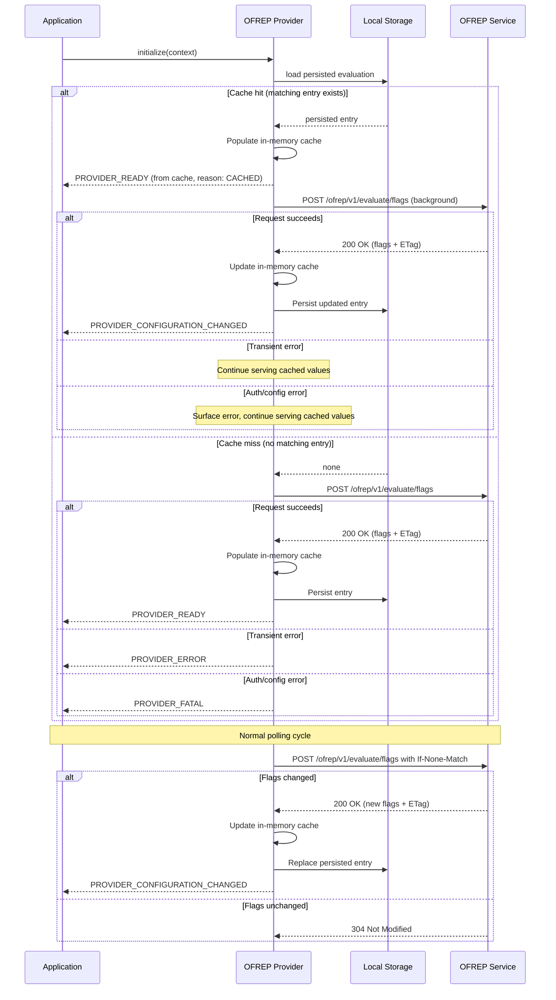

# 9. Persist static-context evaluations in local storage by default

Date: 2026-03-06

## Status

Proposed

## Context

OFREP static-context providers evaluate all flags in one request and then serve evaluations from a local cache.
Current implementations in `js-sdk-contrib`, `kotlin-sdk-contrib`, and `ofrep-swift-client-provider` keep that cache in memory only.

Static-context providers are primarily web and mobile providers, where applications are often restarted or temporarily offline.
In those cases, the last successful bulk evaluation is lost and applications fall back to errors or code defaults instead of continuing with a usable last-known state.
This is also out of step with most vendor-provided web and mobile SDKs for the same class of provider, which persist flag state to local storage or on-device disk by default.

Vendor SDKs from LaunchDarkly, Statsig, DevCycle, and Eppo all use a cache-first initialization pattern: load persisted evaluations immediately on startup so initial synchronous flag evaluations never return defaults, refresh from the network in parallel, and emit change events when fresh values arrive.
See [vendor mobile SDK caching research](https://gist.github.com/jonathannorris/4f2f63142b70719e3c6bfe8b226a0585) for a detailed comparison.

Persisting the last successful static-context evaluation and loading it on startup would extend the existing cache model across restarts and temporary connectivity loss without requiring protocol changes, while eliminating the flash-of-defaults problem that occurs when applications wait for a network response before evaluations return meaningful values.

## Decision

Static-context providers should persist their last successful bulk evaluation in local persistent storage by default, and use cache-first initialization to serve persisted evaluations immediately on startup.

The persisted entry should include:

- the bulk evaluation payload
- the associated `ETag`, if one was returned
- a `cacheKeyHash` equal to `hash(targetingKey)`
- the time the entry was written, which can be used for diagnostics and optional implementation-specific staleness policies

Example persisted value:

```json
{
  "cacheKeyHash": "hash(targetingKey)",
  "etag": "\"abc123\"",
  "writtenAt": "2026-03-07T18:20:00Z",
  "data": {
    "flags": [
      {
        "key": "discount-banner",
        "value": true,
        "reason": "TARGETING_MATCH",
        "variant": "enabled"
      }
    ]
  }
}
```

The provider should continue to use its in-memory cache for normal flag evaluation.
Persistent local storage acts as the source used to bootstrap that in-memory cache on startup and update it on each successful refresh.

### Initialization

During initialization, a provider should follow a cache-first approach:

1. Attempt to load a matching persisted bulk evaluation from local storage (matching `cacheKeyHash`).
2. **If a matching persisted entry exists (cache hit):**
   - Populate the in-memory cache from the persisted entry immediately.
   - Return from `initialize()` so the SDK can emit `PROVIDER_READY`. Evaluations served from the persisted entry should use `CACHED` as the evaluation reason.
   - Attempt the `/ofrep/v1/evaluate/flags` request in the background.
   - If the background request succeeds, update the in-memory cache from the response, update the persisted entry, and emit `PROVIDER_CONFIGURATION_CHANGED`. Evaluations should switch to the server-provided reasons.
   - If the background request fails with a transient or server error (network unavailable, `5xx`), continue serving cached values and retry on the normal polling schedule.
   - If the background request fails with an authorization or configuration error (`401`, `403`, `400`), surface the error via logging or provider error events but continue serving cached values for this session.
3. **If no matching persisted entry exists (cache miss):**
   - Attempt the `/ofrep/v1/evaluate/flags` request and await the response.
   - If the request succeeds, populate the in-memory cache from the response, persist the entry, and return from `initialize()` (SDK emits `PROVIDER_READY`).
   - If the request fails with a transient or server error, preserve the existing initialization failure behavior (SDK emits `PROVIDER_ERROR`).
   - If the request fails with an authorization or configuration error, preserve the existing initialization failure behavior with a fatal error code (SDK emits `PROVIDER_FATAL`).



### Cache matching and fallback

Providers should only reuse a persisted evaluation when it matches the current static-context inputs.
This includes a matching `cacheKeyHash` equal to `hash(targetingKey)`.

When the provider has not initialized from cache (cache miss path), providers must not silently fall back to persisted data for authorization failures, invalid requests, or other responses that indicate a configuration or protocol problem.

When the provider has already initialized from cache (cache hit path), authorization or configuration errors from the background refresh should be surfaced via logging or provider error events, but the provider should continue serving cached values for the current session rather than revoking a working state.

### Refresh and revalidation

When connectivity returns or during normal polling, the provider should resume its normal refresh behavior.
If an `ETag` was stored with the persisted entry, the provider should use it with `If-None-Match` when revalidating the bulk evaluation.

### Configuration

Providers should allow applications to disable the default persistence behavior, for example with a `disableLocalCache` option, or replace the storage backend when platform requirements or policy constraints require it.

## Consequences

### Positive

- Cache-first initialization eliminates the flash-of-defaults problem, where applications briefly show default values before evaluated values arrive
- Static-context providers become resilient to offline application startup when a last-known evaluation exists
- Web and mobile applications preserve feature state across restarts instead of losing it with the in-memory cache
- The decision aligns with the established pattern used by vendor SDKs (LaunchDarkly, Statsig, DevCycle, Eppo) and with the existing OFREP model where static-context providers evaluate remotely once and then read locally
- Reusing the stored `ETag` allows efficient revalidation when connectivity returns
- Provider implementations get a consistent default expectation for offline behavior across ecosystems

### Negative

- Providers become more complex because they must manage persistence, cache-key matching, and recovery flows
- Persisted evaluations may become stale, so applications can continue using outdated flag values while offline
- Applications may briefly see stale cached values before fresh values arrive, and should handle `PROVIDER_CONFIGURATION_CHANGED` events if they need to react to updates
- Persisting evaluation data on-device means flag values are stored in plaintext in platform-local storage, which may be accessible to other code running in the same origin (web) or on compromised devices (mobile)
- Mobile platforms do not share a single storage API, so providers may need platform-specific defaults behind a common abstraction

## Alternatives Considered

### Make persistence opt-in instead of the default

This reduces default behavior changes, but it produces inconsistent offline behavior across provider implementations and requires every application to rediscover and enable the same capability.
For static-context providers, especially web and mobile providers, persistence is expected behavior rather than an exceptional optimization.

### Fall back to cache only on network failure

In this approach, the provider always attempts the network request first and only falls back to cached evaluations when the request fails.
This is simpler to implement but introduces the flash-of-defaults problem on every normal startup: applications must wait for the network response before flag evaluations return meaningful values.
Every major vendor SDK (LaunchDarkly, Statsig, DevCycle, Eppo) uses cache-first initialization instead because it produces better UX for end users.

## Implementation Notes

- "Local storage" means a local persistent key-value store appropriate for the runtime, such as browser `localStorage` on the web or an equivalent mobile storage mechanism
- Providers should version their persisted format so future schema changes can be handled safely
- Providers should avoid persisting raw `targetingKey` values when `cacheKeyHash` is sufficient for matching
- Providers should expose a `disableLocalCache` option to turn off persisted local storage
- Providers should clear or replace persisted entries when the `targetingKey` changes, such as on logout or user switch
- The `initialize()` function should return immediately when a matching cached entry exists, allowing the SDK to emit `PROVIDER_READY` from cache
- Providers should emit `PROVIDER_CONFIGURATION_CHANGED` when fresh values replace cached values after a background refresh
- SDK documentation should note that initial evaluations may return cached values (with `CACHED` reason) that are subsequently updated when fresh values arrive

## Open Questions

1. Should providers support caching evaluations for multiple targeting keys (like LaunchDarkly's `maxCachedContexts`), or only retain the most recent? Multi-context caching enables instant user switching on shared devices but increases storage usage.
2. Should providers enforce a TTL on persisted entries (e.g. 30 days, similar to DevCycle's `configCacheTTL`)? A TTL would ensure stale caches are eventually purged, particularly in cases where the provider can no longer refresh from the server (e.g. persistent auth errors). If so, should the TTL be configurable?
